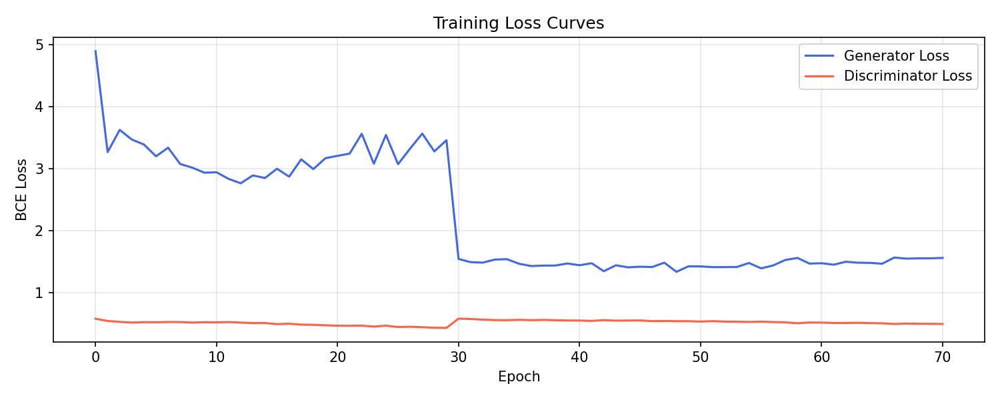

#  Text-to-Image GAN

A conditional GAN that generates images from text captions, built with PyTorch + CLIP.

## Architecture
- **Text Encoder**: Frozen CLIP ViT-B/32 (512-d embeddings)
- **Generator**: ConvTranspose2d stack → 64×64 RGB images
- **Discriminator**: CNN + text projection for conditional adversarial loss
- **Hardware**: Apple M2 MPS / CUDA (Colab T4) / CPU auto-detection

## Results
Training progression over 30 epochs on Flickr8k (8K images):

| Epoch 5 | Epoch 15 | Epoch 30 |
|---------|----------|----------|
|  |  |  |

### Inference: "a red bird sitting in a tree"

### Loss Curves

## Setup

### 1. Clone the repo
\`\`\`bash
git clone https://github.com/YOUR_USERNAME/text-to-image-gan.git
cd text-to-image-gan
\`\`\`

### 2. Create virtual environment
\`\`\`bash
python3.11 -m venv venv
source venv/bin/activate
\`\`\`

### 3. Install dependencies
\`\`\`bash
pip install torch torchvision
pip install git+https://github.com/openai/CLIP.git
pip install -r requirements.txt
\`\`\`

### 4. Download Flickr8k dataset
\`\`\`bash
kaggle datasets download -d adityajn105/flickr8k --path ./flickr8k --unzip
\`\`\`

### 5. Run the notebook
\`\`\`bash
jupyter lab text_to_image_gan.ipynb
\`\`\`

## Hardware
- Tested on Apple M2 MacBook (MPS)
- Compatible with Google Colab T4 GPU
- Falls back to CPU automatically

## Dataset
Flickr8k — 8,000 images with 5 captions each.
Download via Kaggle: `adityajn105/flickr8k`
